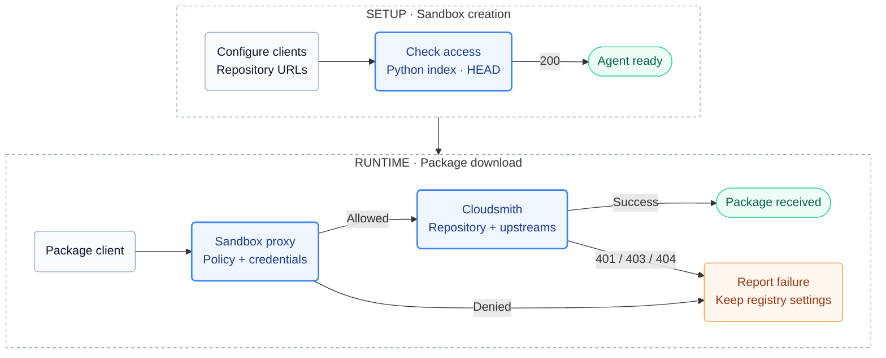

# cloudsmith-repo

Points the sandbox's package managers at one [Cloudsmith](https://cloudsmith.com) repository. pip/uv, npm/pnpm/yarn, Go, cargo, Maven, NuGet, Docker and raw downloads all pull through it. The repository's vulnerability, license and deny policies decide what the agent gets. The sandbox proxy authenticates requests using a read-only [entitlement token](https://docs.cloudsmith.com/software-distribution/entitlement-tokens) stored on the host. Works with any base agent.

Companions: [`cloudsmith-cli`](https://github.com/docker/sbx-kits-contrib/tree/main/cloudsmith-cli) (the `cloudsmith` command and an API key), [`cloudsmith-dependency-firewall`](https://github.com/docker/sbx-kits-contrib/tree/main/cloudsmith-dependency-firewall) (deny the public registries).

## Usage

Store the repository's entitlement token once (skip for a public repository):

```console
sbx secret set cloudsmith-entitlement-token
```

Create a sandbox pointed at the repository:

```console
sbx run claude --kit "docker.io/sbx/cloudsmith-repo-kit:latest" --kit-arg cloudsmith-repo.path=/acme/prod .
```

The Git examples require `github.com/docker/` in Docker's `kit.allowedSources` setting. Preserve any existing allowed sources when adding it; see [Restrict kit sources](https://docs.docker.com/ai/sandboxes/customize/kits/#restrict-kit-sources).

Or from git or a local clone:

```console
sbx run --kit "git+https://github.com/docker/sbx-kits-contrib.git#dir=cloudsmith-repo" --kit-arg cloudsmith-repo.path=/acme/prod claude
sbx run claude --kit ./cloudsmith-repo/ --kit-arg cloudsmith-repo.path=/acme/prod .
```

On first use, approve the configured Cloudsmith hosts in the credential-binding prompt. For unattended runs, create the binding beforehand by running interactively once or configuring [credential bindings](https://docs.docker.com/ai/sandboxes/configuration/credentials/#credential-bindings). Without an approved binding, the token is withheld and private repository access fails.

Prerequisites:

- The repository has [upstreams](https://docs.cloudsmith.com/repositories/upstreams) for the formats in use. Without them it serves only what was pushed.
- Apply this kit when creating a sandbox with `--kit`. Recreate an existing sandbox to add it.
- List this kit before kits whose install runs `npm` or `pip`; their installs then go through the repository. `bun` is not configured.
- The base image has `npm` (all standard templates do). `~/.cargo/config.toml`, `~/.m2/settings.xml` and `~/.nuget/NuGet/NuGet.Config` are overwritten on every start.
- Tested with sbx 0.42.x.

## Arguments

`--kit-arg cloudsmith-repo.<name>=<value>`. Values are substituted textually, so each pattern also keeps shell metacharacters out.

| Argument | Default | Value |
| --- | --- | --- |
| `path` | `/cloudsmith/cli` | `/ORG/REPO` on `*.cloudsmith.io`; `/REPO` on a namespace-level [custom domain](https://docs.cloudsmith.com/workspaces/custom-domains); empty on a repository-level one |
| `dl-host` | `dl.cloudsmith.io` | Download host: Python index, raw, Maven, NuGet packages, and every blob redirect |
| `npm-host` | `npm.cloudsmith.io` | npm registry |
| `go-host` | `golang.cloudsmith.io` | Go module proxy and checksum database |
| `cargo-host` | `cargo.cloudsmith.io` | Cargo sparse index |
| `nuget-host` | `nuget.cloudsmith.io` | NuGet v3 feed |
| `docker-host` | `docker.cloudsmith.io` | Docker registry |

The default `path` is Cloudsmith's public CLI repository, so the kit validates and installs with no inputs. Always set it.

Custom domains: set `path` to the shorter form and override every host, all at the same level. Cloudsmith redirects npm, Go, cargo and Docker blobs to the organization's primary download domain, so a custom `dl-host` alone breaks the default hosts. Copy the hosts from the repository's setup page.

```console
sbx run claude --kit "docker.io/sbx/cloudsmith-repo-kit:latest" \
  --kit-arg cloudsmith-repo.path=/prod \
  --kit-arg cloudsmith-repo.dl-host=dl.acme.com --kit-arg cloudsmith-repo.npm-host=npm.acme.com \
  --kit-arg cloudsmith-repo.go-host=go.acme.com --kit-arg cloudsmith-repo.cargo-host=cargo.acme.com \
  --kit-arg cloudsmith-repo.nuget-host=nuget.acme.com --kit-arg cloudsmith-repo.docker-host=docker.acme.com .
```

## Supported formats

`<dl>`, `<npm>`, `<go>`, `<cargo>`, `<nuget>` and `<docker>` stand for the host arguments, `<path>` for the `path` argument. No setting contains a credential. The proxy adds it.

| Format | Tools | Configured by | Repository URL | Check inside the sandbox |
| --- | --- | --- | --- | --- |
| Python | pip, uv | `PIP_INDEX_URL`, `UV_DEFAULT_INDEX`, `PIP_NO_INPUT=1` | `https://<dl>/basic<path>/python/simple/` | `pip download --no-deps -d /tmp <pkg>` |
| npm | npm, Yarn Classic, Yarn Berry, pnpm | `NPM_CONFIG_REGISTRY`, `YARN_NPM_REGISTRY_SERVER`, `~/.npmrc` (pnpm) | `https://<npm><path>/` | `npm view <pkg> version` |
| Go | go | `GOPROXY` (no `,direct`) | `https://<go><path>/` | `GONOSUMDB=<prefix> go get <module>@<ver>` |
| Cargo | cargo | `~/.cargo/config.toml` (crates.io replaced), dummy `CARGO_REGISTRIES_CLOUDSMITH_TOKEN` | `sparse+https://<cargo><path>/` | `cargo add <crate> && cargo fetch` |
| Maven | mvn | `~/.m2/settings.xml` (`mirrorOf *`) | `https://<dl>/basic<path>/maven/` | `mvn -q dependency:resolve` |
| NuGet | dotnet | `~/.nuget/NuGet/NuGet.Config` (`<clear/>`, one source) | `https://<nuget><path>/v3/index.json` | `dotnet restore` |
| Docker | docker | nothing; host is in the image name | `<docker><path>/<image>:<tag>` | `docker pull <docker><path>/<image>:<tag>` |
| Raw | curl | nothing | `https://<dl>/basic<path>/raw/names/<n>/versions/<v>/<file>` | `curl -fsSL -o f <url>` |

Per-format notes:

- **Python**: pip prints "No matching distribution found" for both 401 and 404; `pip -vvv` shows the status. uv reports 401, 403 and 404 distinctly.
- **npm**: quarantine is `E403 Package is quarantined`; `npm view` still lists the version. A project `.npmrc` with `@scope:registry=` wins over the env var.
- **Go**: the Go host answers 404, not 401, for a bad token or path. Private modules need `GONOSUMDB=<prefix>`; do not use `GOPRIVATE`, which bypasses the proxy.
- **Cargo**: cargo needs some local token when the registry says `auth-required`; the kit sets a dummy and the proxy replaces the header.
- **Maven**: uses the download host mirror (`/basic<path>/maven/`), which serves artifacts inline. Keep that mirror; `maven.cloudsmith.io` redirects every file to a signed URL.
- **NuGet**: a 401 surfaces as `NU1301` on `repository-signatures/5.0.0/index.json`.
- **Docker**: pull only. `docker push` needs an API key login.
- **Raw**: pin versions. `versions/latest/` redirects with the entitlement token in the URL (see Security).

Not covered: RubyGems, Conda, Composer, Hex, Dart, Swift, Conan, Terraform, apt, rpm. Same auth model, client setup not verified.

## Authentication

Private repositories use the `cloudsmith-entitlement-token` stored in the [usage steps](#usage); public repositories need no token. The sandbox proxy adds `Authorization: Bearer <token>` to requests to the configured Cloudsmith hosts. Inside the sandbox, `CLOUDSMITH_ENTITLEMENT_TOKEN` holds `proxy-managed`, and Cargo uses a placeholder token.

Use a read-only token scoped to the repository. See [Security](#security) for the raw-download redirect limitation and token rotation guidance.

## How it works



- **Probe.** The first install step sends `HEAD` to the Python index through the proxy. Anything but 200 stops creation: 401 (no token reached Cloudsmith), 403 (token rejected, or host denied by policy), 404 (wrong `path` for the domain level). It checks the download host only.
- **Policy.** A version blocked by a [vulnerability](https://docs.cloudsmith.com/policy-management/vulnerability-policy), license or deny policy returns 403. Scanning is asynchronous and the CDN can serve a stale answer for about five minutes after a quarantine.
- **Agent note** (`kits-agent-context/cloudsmith-repo.md`): report 401/403/404 with package, version, host and status; never switch a tool to a public registry.
- **Scope.** sbx policy is per hostname. This kit allows hosts and configures clients; it does not prove every artifact came from the repository (pre-installed tools, caches, hosts other kits allow). For blocking the public registries, compose [`cloudsmith-dependency-firewall`](https://github.com/docker/sbx-kits-contrib/tree/main/cloudsmith-dependency-firewall).

### Why these domains

`permissions.network.allow` is the kit's complete outbound contract; CI runs e2e under `deny-all`.

| Domain | Why |
| --- | --- |
| `<dl-host>` | Python index and wheels, raw, Maven, NuGet packages, and the pre-signed `/signed/...` redirects for npm, Go, cargo and Docker blobs |
| `<npm-host>` | npm metadata |
| `<go-host>` | Go module proxy and proxied `sum.golang.org` |
| `<cargo-host>` | Cargo sparse index |
| `<nuget-host>` | NuGet v3 service index, signatures, registration |
| `<docker-host>` | Docker registry `/v2/` |

Not allowed: `sum.golang.org` (proxied by Cloudsmith), `python.cloudsmith.io` (no read endpoints), `api.cloudsmith.io` (lives in `cloudsmith-cli`). `dl.cloudsmith.io` is shared by every public Cloudsmith repository; host-level policy cannot narrow it to one.

## Security

- The token is read-only and repository-scoped. Use one token per trust context.
- One Cloudsmith endpoint leaks it: a raw `versions/latest/<file>` request returns a 302 whose `Location` contains the token. The kit cannot block a URL, so treat the token as extractable by a hostile agent. Rotation order: revoke in Cloudsmith, `sbx secret set` the new value, recreate sandboxes.
- Pre-signed download URLs are short-lived bearer capabilities; keep them out of logs.

## Troubleshooting

| Symptom | Cause | Fix |
| --- | --- | --- |
| `sbx create` fails at the first install step with `exit 1` | Probe did not get 200; sbx hides the output and rolls the sandbox back | Create with `--name`, read `[cloudsmith-repo]` in the sandboxd daemon log, and `sbx policy log <name>` (survives the rollback) |
| Probe 401 | No token reached Cloudsmith, or the approval prompt was declined | `sbx secret set cloudsmith-entitlement-token -t <token>`, recreate in a terminal, answer `A` |
| Probe 403 | Token not valid for this repository, or `dl-host` denied by a policy above the kit | `sbx policy log <name>` first; then test the token from the host with `curl -I -H "Authorization: Bearer <token>" https://<dl>/basic<path>/python/simple/` |
| Probe 404 | Wrong `path` for the domain level | `/ORG/REPO`, `/REPO` or empty |
| Metadata works, downloads blocked on `dl.<custom>` | Organization has a custom download domain | Set every host argument to the custom domain |
| 403 with "quarantined" | Repository policy | Check the package in Cloudsmith; do not use a public registry |
| 404 for a package that exists publicly | No upstream for that format | Add a Cache and Proxy upstream |

## Cleanup

```console
sbx secret rm cloudsmith-entitlement-token -f
```

Config files inside the sandbox disappear with `sbx rm <sandbox>`. Rotate the token when retiring a sandbox that ran untrusted code.
